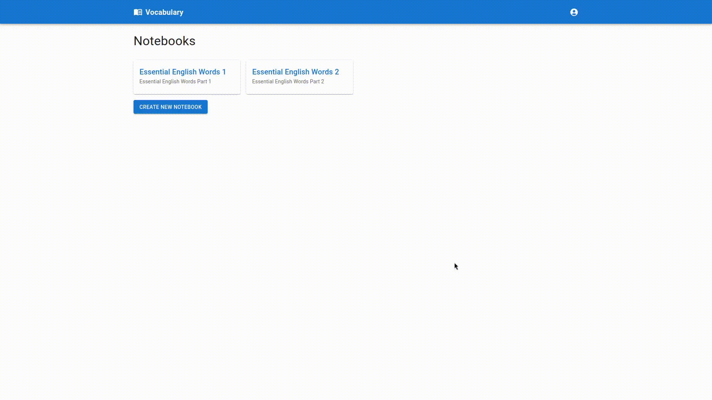

## Vocabulary Notebook Application
This part of the application is responsible for the user interface and client-side functionality.

#### Technologies Used:
- Next.js
- Material UI

## Backend Repository
You can find the backend part of the application [here](https://github.com/denyshuzovskyi/vocabulary-notebook).

## Demo


## Getting Started

1. **Clone the repository**:
    ```bash
    git clone https://github.com/denyshuzovskyi/vocabulary-notebook-ui
    cd vocabulary-notebook-ui
    ```

2. **Install dependencies**:
    ```bash
    npm install
    ```

3. **Start the development server**:
    ```bash
    npm run dev
    ```
   
Then open [http://localhost:3000](http://localhost:3000)


